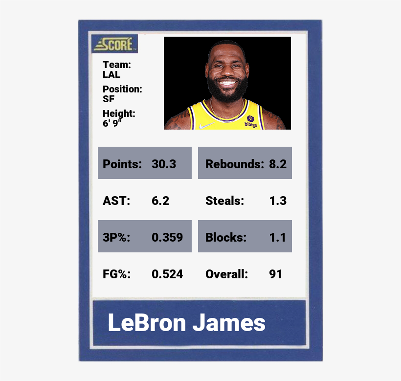

# NBA Cards
Basic Programming in Python: Final Assignment
---
SoSe 2022
---
Group 17: Johannes Dittrich, Lena Sterrenberg, Sarah Schelper
---

## Table of Contents
* [About](#about)
* [Technologies Used](#technologies-used)
* [Data and Sources](#data-and-sources)
* [General Information](#general-information)
* [Features shown on the cards](#features-shown-on-the-cards)
* [Usage](#usage)
* [Screenshot of an example card](#screenshot-of-an-example-card)

## About
This program allows you to enter the name of an NBA player and to get a card showing general information, player's statistics (from season 2021/22) and a photo of the player.

## Technologies Used
* Language: Python Version 3.7
* Libraries
  * cmath
  * io
  * pandas
  * matplotlib.pyplot
  * numpy
  * matplotlib.imagepip
  * PIL
  * requests
  * math
  * os
  * bing_image_downloader
  * unicodedata

## Data and Sources
* Data sets
  * Player_Generell_Information.csv from: https://www.kaggle.com/datasets/buyuknacar/202122-nba-season-active-nba-players?select=players.csv
  * Player_ID.csv from: https://sports-statistics.com/sports-data/nba-basketball-datasets-csv-files/
  * Player_Stats.csv from: https://data.world/etocco/nba-player-stats
* Photos from:
  * https://ak-static.cms.nba.com/wp-content/uploads/headshots/nba/latest/260x190/2544.png (last digits before .png are the player ID)
  * https://www.bing.com/
* Card Template: https://icon-library.com/png/399795.html

## General Information
For this project we used 3 datasets containing different information on NBA players ("general_information", "stats" and "player_id").

First, the data was preprocessed:

* in the "stats" dataset, all empty cells were filled with zeros in order to calculate an overall score
* special names were converted to normal letters
* Offense and Defense Rebounds were summed up to get just one rebound value
* an overall score was calculated
* columns that are not further used were dropped; only data from the season 2021/22 was used

Then, the datasets "general_information" and "stats" were merged using the pandas.merge function (inner merge) and the result was merged with the dataset "player_id" using a left merge.
The resulting dataset "final_data" was stored in a csv-file.

To generate the card showing the player's general information, statistics and photo, a function called "save_card(name)" was implemented with the following steps:

* card template is prepared to be used: fonts, sizes, boxes for statistics
* name is printed on the bottom of the card
* general information is printed on the left upper corner
* statisitcs are printed below the photo
* photo is printed on the right upper corner: function get_image(url) is used if the photo is searched via the player ID, otherwise we use the function bing_get_image(name)

To show and save the generated card, the function show_card(card) was implemented.

Lastly, the program also contains the function save_all_cards() that allows to generate a card for every player and save them in a folder.

## Features shown on the cards
* Name: size is adjusted according to length of the name
* Photo: if player ID was available, it is printed from the official NBA website, if not, we used bing web search
* General Data
  * Team: If a player changed the team during the season, a card for each team he played for, is generated
  * Position: C (center), G (guard), SG (shooting guard), PG (point guard), F (forward), SF (small forward), PF (power forward)
  * Height: in feet and inches
* Stats
  * Average points per game
  * Average assists per game (AST)
  * 3-point-shot percentage (3P%)
  * Field goal percentage (FG%)
  * Average rebounds (Reb): Offense Rebounds + Defense Rebounds
  * Average steals
  * Average blocks
  * Overall Score: calculated based on the other statistics, normalized, values from 0 to 100

## Usage
You can use this program by typing in the full name of the player you want to generate a card for.
For example: 

`"LeBron James"`

`"Nikola Jokic"`

At the end of the program, a list with example players is provided.

To create a folder containing NBA cards of every player, use:

`save_all_cards()` (This may take up to 10 minutes. There is already a folder called "all_players" in the repository with all cards inside.)

## Screenshot of an example card
